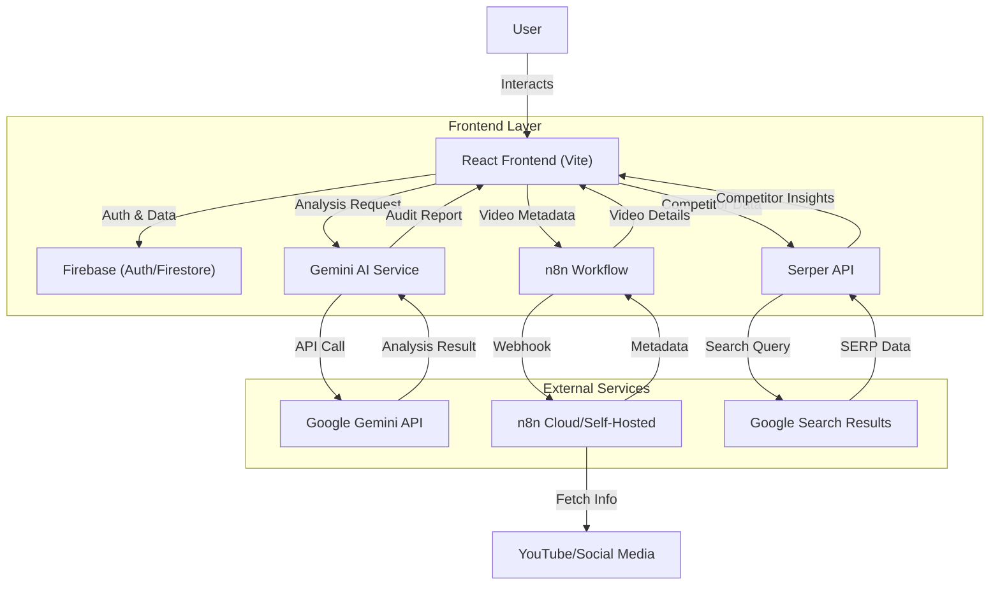

# 🚀 GritGrade - Content Quality Audit Tool

## 📌 A. Problem Statement

Content creators need a single tool to check if their content is SEO-optimized, AI-discoverable,
sounds human, and stands out from competitors.
<h4>What to Build<h4>
A content audit tool that scores text across 4 dimensions with actionable recommendations. 

---

## 📌 B. Solution Overview

**GritGrade** is an intelligent content audit platform powered by **Google Gemini AI**. It provides a holistic analysis of your content, offering actionable insights to improve visibility, engagement, and ranking.

### Key Capabilities:
*   **AI-Powered Analysis**: Uses Gemini 2.5 Flash to deeply understand content context, sentiment, and quality.
*   **Multi-Dimensional Scoring**: Evaluates content on SEO, AEO, Humanization, Differentiation, Freshness,Tone & Voice,Linking,etc. and for video(reels/youtube/instagram) content it also checks for Hook Strength,Visuals,Captions,Viral potential,Hashtags and more.
*   **Video & Text Support**: Audits both written articles,blog posts, case studies,product pages and video scripts (YouTube/Instagram) via n8n integration.
*   **Competitor Intelligence**: Fetches real-time SERP data to compare your content against top-ranking results.
*   **Actionable Feedback**: Provides specific recommendations to fix issues and improve scores.

**Impact**: Drastically reduces auditing time from hours to minutes while improving content performance across search and social platforms.

---

## 📌 C. Architecture Diagram

The following diagram illustrates the high-level architecture of GritGrade:



---

## 📌 D. Tech Stack

### Frontend
*   **React 18**: UI Library
*   **TypeScript**: Type safety and developer experience
*   **Vite**: Build tool and development server
*   **Tailwind CSS**: Utility-first styling
*   **React Router**: Navigation

### Backend & Services
*   **Firebase**: Authentication (Google Auth) and Firestore Database
*   **Google Gemini API**: Core AI analysis engine (Gemini 2.5 Flash)
*   **n8n**: Workflow automation for fetching video metadata (transcripts, views, likes)
*   **Serp API**: Real-time Google Search results for competitor analysis

### Tools & Libraries
*   **Recharts**: Data visualization
*   **jsPDF**: Report generation
---

## 📌 E. How to Run Your Project

Follow these steps to set up and run GritGrade locally.

### Prerequisites
*   Node.js (v18+)
*   npm or yarn
*   Git

### Step-by-Step Instructions

1.  **Clone the Repository**
    git clone https://github.com/Mani-kanta-0539/Audit.git
    

2.  **Install Dependencies**
    npm install

3.  **Configure Environment Variables**
    Create a `.env` file in the root directory and add your API keys (see Section F).

4.  **Run the Development Server**
    npm run dev

5.  **Access the Application**
    Open your browser and navigate to `http://localhost:5173`.

## 📌 F. API Keys / Usage Notes

To run this project, you need to configure the following keys in your `.env` file.

> **⚠️ SECURITY WARNING**: Never commit your `.env` file to version control. Use placeholders when sharing code.

```env
# Firebase Configuration (Required for Auth & DB)
VITE_FIREBASE_API_KEY=your_firebase_api_key
VITE_FIREBASE_AUTH_DOMAIN=your_project.firebaseapp.com
VITE_FIREBASE_PROJECT_ID=your_project_id
VITE_FIREBASE_STORAGE_BUCKET=your_project.appspot.com
VITE_FIREBASE_MESSAGING_SENDER_ID=your_sender_id
VITE_FIREBASE_APP_ID=your_app_id

# AI Service (Required)
VITE_GEMINI_API_KEY=your_gemini_api_key

# External Integrations (Optional but recommended)
VITE_SERP_API_KEY=your_serper_api_key
VITE_N8N_WEBHOOK_URL=your_n8n_webhook_url
VITE_N8N_ENABLED=true
```

**Where to get keys:**
*   **Firebase**: [Firebase Console](https://console.firebase.google.com/)
*   **Gemini API**: [Google AI Studio](https://aistudio.google.com/)
*   **Serper API**: [Serper.dev](https://serper.dev/)
*   **n8n**: [n8n.io](https://n8n.io/) (or self-hosted)

---

## 📌 G. Sample Inputs & Outputs

### Input
**Type**: URL Analysis
**URL**: `https://example.com/blog/future-of-ai`
**Target Keyword**: "Artificial Intelligence Trends"

### Output (Audit Report)
The system generates a comprehensive JSON object visualized in the dashboard:

```json
{
  "overallScore": 85,
  "dimensions": {
    "seo": {
      "score": 90,
      "issues": ["Meta description is too short"],
      "recommendations": ["Expand meta description to 160 chars"]
    },
    "humanization": {
      "score": 82,
      "analysis": "Tone is professional but slightly robotic in section 2."
    },
    "aeo": {
      "score": 88,
      "voiceSearchOptimized": true
    }
  },
  "competitorComparison": {
    "yourRank": "Estimated Top 10",
    "topCompetitor": "TechCrunch Article"
  }
}
```

---

## 📌 H. Video Demo Link

Watch the full demo of GritGrade in action:


-----
------
<div align="center">

[https://mani-kanta-0539.github.io/Audit/](https://mani-kanta-0539.github.io/Audit/) 
<p>This is our published version of the project<br>
note: this is not the final version of the project, there are some unaccurate results in video analysis due to the n8n localhost webhook url changing every time the server restarts and we try to improve our workflows</p>

**Made with ❤️ by the GritGrade Team**
</div>
